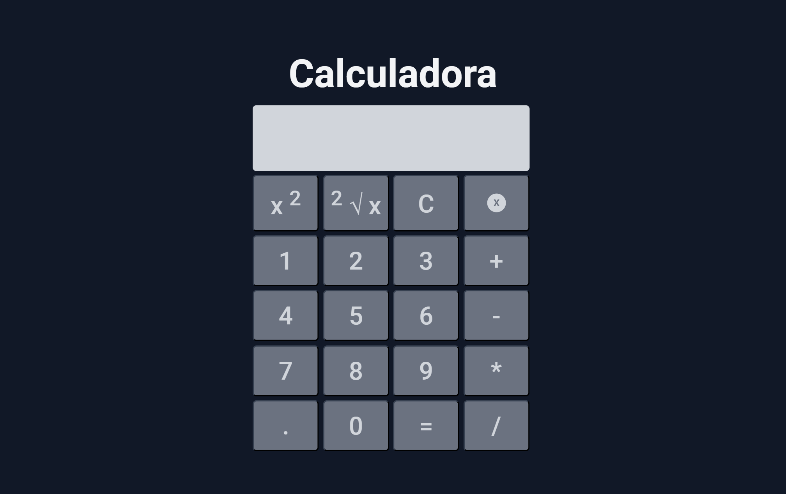

# Calculadora

## Projeto 💻
Projeto de uma calculadora básica.

## Layout 🔖
Segue abaixo o layout deste projeto:
- [Figma](https://www.figma.com/file/EFOxZnz8E1q0JAF1cSphFt/Calculadora?t=6c0QNz1uWFLpDSVD-6)

## Instalação 🛠
Siga esses passos para instalar o repositório na sua máquina:
1. Rode `git clone https://github.com/miishiyama/Calculadora` para fazer um clone desse repositório.
2. Abra o arquivo HTML.

## Tecnologias 🚀
As tecnologias utilizadas neste projeto são:
- HTML
- CSS
- DOM
- JavaScript
- Google Fonts

## Créditos ❤️
Feito por [Millene Eduarda Ishiyama](https://github.com/miishiyama/).
